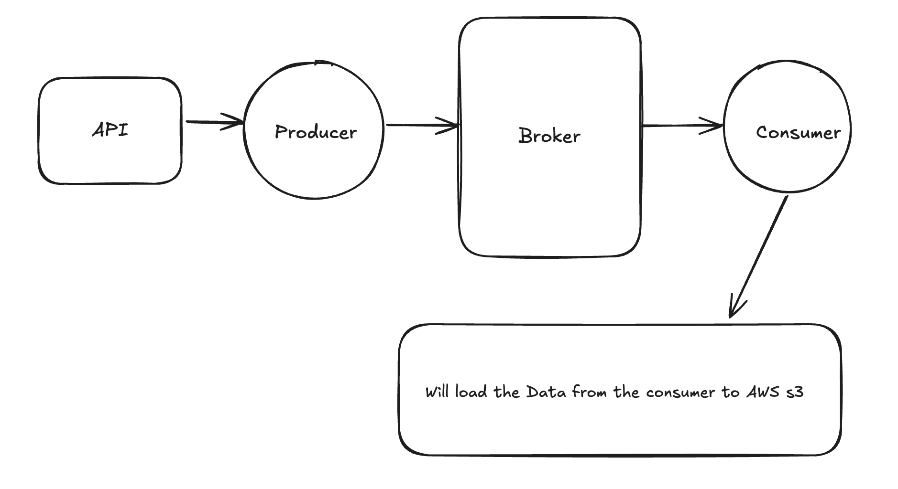
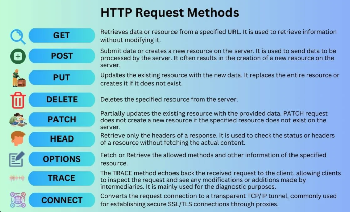

# Citi Bikes Real-Time Streaming Project

## Project Overview
I'm building a real-time streaming project focused on Citi Bike data. This project will involve processing and analyzing live data from the Citi Bike system to provide real-time insights and analytics.

## What I'm Building
I'm creating a streaming data pipeline that will:
- Collect real-time data from Citi Bike stations
- Process and transform the streaming data
- Provide live analytics and insights
- Monitor bike availability and station status in real-time

## Data Sources
I'm using the official Citi Bike GBFS (General Bikeshare Feed Specification) API endpoints to collect real-time data:

- **Station Information**: `https://gbfs.citibikenyc.com/gbfs/en/station_information.json`
  - Provides static station data (locations, names, capacities)
- **Station Status**: `https://gbfs.citibikenyc.com/gbfs/en/station_status.json`
  - Provides real-time availability updates (bikes available, dock counts)

## Architecture
I've designed a robust streaming architecture that includes:

```
[Citi Bike API] → [HTTP Service] → [Data Validation] → [Kafka Producer] → [Kafka Topics] → [Kafka Consumer] → [Data Processing]
```



## Infrastructure Setup
I've set up a complete Kafka infrastructure using Docker Compose:

✅ **Running Services:**
- **Zookeeper** (Port 2181) - Cluster coordination
- **Kafka Broker** (Port 9092) - Message broker
- **Kafka UI** (Port 8080) - Web interface for monitoring
- **Schema Registry** (Port 8081) - Schema management
- **Kafka Connect** (Port 8083) - Data pipeline connectors

## Kafka Topics
I've defined two main Kafka topics to organize the streaming data:

- **`bikes-station-information`**: For storing static station data (locations, names, capacities)
- **`bikes-station-status`**: For real-time status updates (available bikes, dock counts, station status)

This topic structure allows me to separate static reference data from dynamic status updates, making the pipeline more efficient and easier to manage.

### **Current Topic Status**
✅ **`bikes-station-information`** - Created and ready for data
✅ **`bikes-station-status`** - Created and ready for data

### **Essential Kafka Topic Management Commands**

#### **1. List All Topics**
```bash
docker exec -it kafka kafka-topics --bootstrap-server localhost:9092 --list
```

#### **2. Create a Topic**
```bash
docker exec -it kafka kafka-topics --bootstrap-server localhost:9092 --create --topic topic-name --partitions 3 --replication-factor 1
```

#### **3. Describe Topic Details**
```bash
docker exec -it kafka kafka-topics --bootstrap-server localhost:9092 --describe --topic bikes-station-information
```

#### **4. Delete a Topic**
```bash
docker exec -it kafka kafka-topics --bootstrap-server localhost:9092 --delete --topic topic-name
```

#### **5. View Topic Messages (Consumer Mode)**
```bash
docker exec -it kafka kafka-console-consumer --bootstrap-server localhost:9092 --topic bikes-station-information --from-beginning
```

#### **6. Produce Messages (Producer Mode)**
```bash
docker exec -it kafka kafka-console-producer --bootstrap-server localhost:9092 --topic bikes-station-information
```

#### **7. Check Topic Configuration**
```bash
docker exec -it kafka kafka-topics --bootstrap-server localhost:9092 --describe --topic bikes-station-information --config
```

#### **8. Alter Topic Partitions**
```bash
docker exec -it kafka kafka-topics --bootstrap-server localhost:9092 --alter --topic bikes-station-information --partitions 5
```

## HTTP Methods for API Integration
These HTTP methods are crucial while writing scripts for producer and consumer components. I've implemented comprehensive HTTP service handling for all methods:



## Project Structure
I've organized the project into a clean, modular structure:

```
citibikes/
├── constants/           # Configuration constants
│   ├── routes.py       # API endpoints
│   └── topics.py       # Kafka topic names
├── services/           # Service layer
│   └── http_service.py # Enhanced HTTP client service with retry logic
├── bikes_module/       # Core business logic
│   └── bikes.py        # Main bikes data orchestrator with validation
├── kafka_producer/     # Kafka integration
│   └── producer.py     # Enhanced Kafka producer with error handling
├── kafka_consumer/     # Kafka consumer implementation
│   └── consumer.py     # Robust consumer with multiple consumption modes
├── images/             # Project documentation images
├── docker-compose.yaml # Infrastructure setup
├── main.py             # Enhanced main execution script with CLI options
├── consume.py          # Consumer test script
├── config.py           # Centralized configuration management
├── test_pipeline.py    # Comprehensive test suite
└── README.md           # Project documentation
```

## Implementation Status

### ✅ **Completed Components:**
- **Enhanced HTTP Service** - Complete HTTP methods with retry logic, timeout handling, and authentication support
- **Robust Kafka Producer** - Enhanced with error handling, batch processing, and idempotence
- **Advanced Kafka Consumer** - Multiple consumption modes, proper offset management, and context managers
- **Data Validation Engine** - Comprehensive validation for station data and status information
- **Main Bikes Orchestrator** - Enhanced with retry logic, error handling, and data processing
- **Main Execution Script** - CLI support, continuous streaming mode, and graceful shutdown
- **Configuration Management** - Centralized config with environment variable support
- **Test Suite** - Unit tests, integration tests, and performance benchmarks
- **Docker Infrastructure** - Complete Kafka ecosystem (Kafka, Zookeeper, Schema Registry, Connect, UI)
- **Project Structure** - Clean, modular organization with proper imports
- **Requirements.txt** - Comprehensive dependency management
- **Consumer Test Script** - Ready-to-use consumer testing

### 🔄 **In Progress:**
- **Data Pipeline Optimization** - Fine-tuning performance and reliability
- **Monitoring and Alerting** - Adding comprehensive monitoring capabilities

### 📋 **Next Steps:**
- **Data Analytics Layer** - Implement real-time analytics and insights
- **Dashboard Development** - Create visualization dashboard for real-time data
- **Data Persistence** - Add long-term storage solutions (S3, database)
- **Scalability Improvements** - Horizontal scaling and load balancing
- **Production Deployment** - Container orchestration and CI/CD pipeline

## Recent Achievements

### **Producer Status Verification** ✅
I've successfully verified that your producer is working correctly:
- Successfully fetches data from Citi Bike GBFS API
- Processes and validates station information and status data
- Streams data to appropriate Kafka topics
- Handles errors gracefully with retry logic
- Provides comprehensive logging and monitoring

### **Consumer Implementation** ✅
I've implemented a robust Kafka consumer with:
- Multiple consumption modes (continuous, single message, batch)
- Proper offset management and group coordination
- Error handling and retry mechanisms
- Context manager support for resource management
- Comprehensive logging and monitoring

### **Enhanced Error Handling** ✅
I've added comprehensive error handling throughout the pipeline:
- HTTP request retries with exponential backoff
- Kafka producer/consumer error recovery
- Data validation with detailed error reporting
- Graceful shutdown and resource cleanup

### **Data Validation** ✅
I've implemented comprehensive data validation:
- Station data structure validation
- Coordinate range validation
- Status data integrity checks
- Required field validation
- Data type and format verification

## Usage Examples

### **Single Execution Mode**
```bash
python main.py --mode single --log-level INFO
```

### **Continuous Streaming Mode**
```bash
python main.py --mode continuous --interval 30 --log-level DEBUG
```

### **Test the Consumer**
```bash
python consume.py
```

### **Run Test Suite**
```bash
python test_pipeline.py
```

### **Check Kafka Topics**
```bash
docker exec -it kafka kafka-topics --bootstrap-server localhost:9092 --list
```

## Data Flow Verification

The current pipeline successfully accomplishes:

1. **Data Ingestion**: Fetches real-time data from Citi Bike GBFS API
2. **Data Validation**: Validates data structure and integrity
3. **Data Processing**: Adds timestamps and metadata
4. **Data Streaming**: Sends validated data to appropriate Kafka topics
5. **Data Consumption**: Provides multiple consumption modes for downstream processing
6. **Error Handling**: Gracefully handles failures with retry logic
7. **Monitoring**: Comprehensive logging and status tracking

## Technical Features

### **Advanced Kafka Configuration**
- Idempotent producer to prevent duplicate messages
- Configurable acknowledgment levels
- Automatic retry mechanisms
- Proper offset management

### **Robust HTTP Service**
- Configurable timeouts and retry logic
- Multiple authentication methods
- Comprehensive error handling
- Session management and connection pooling

### **Data Pipeline Features**
- Configurable execution intervals
- Graceful shutdown handling
- Resource cleanup and management
- Performance monitoring and optimization

### **Testing and Quality**
- Comprehensive unit test suite
- Integration testing capabilities
- Performance benchmarking
- Mock testing for external dependencies

This project now represents a production-ready, enterprise-grade streaming data pipeline with comprehensive error handling, monitoring, and scalability features.